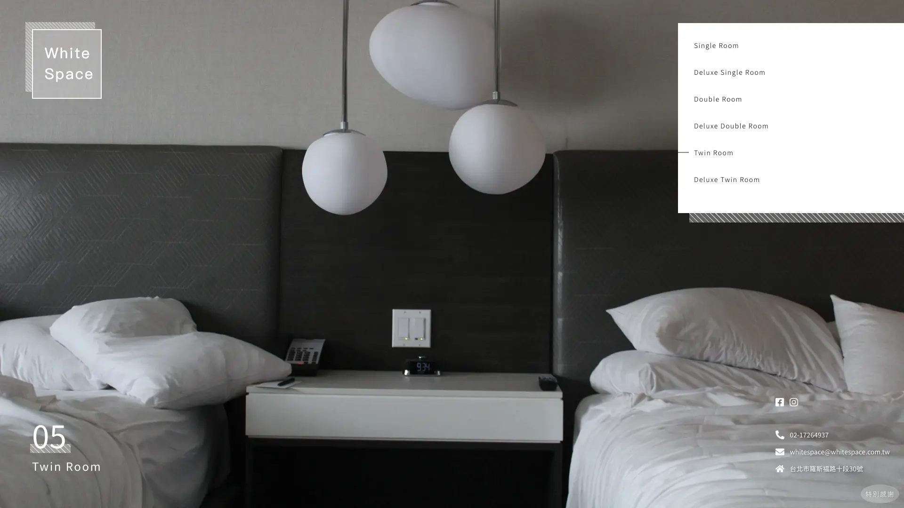

<a name="readme-top"></a>

<div align="center">
  <h1>White Space Hotel</h1>
  <p>
    串接「六角學院旅館 API 服務」，提供查看房型、預約訂房功能
  </p>
  <p>
    <a href="https://yuna9068.github.io/white-space-hotel/">Github Live Site URL</a>
  </p>
</div>


## Table of contents

* [Features](#features)
* [Screenshot](#screenshot)
* [Built with](#built-with)
* [Getting Started](#getting-started)
    * [Prerequisites](#prerequisites)
    * [Installation](#installation)
* [Acknowledgments](#acknowledgments)
* [Author](#author)


## Features

* 首頁能看到所有房型
* 單一房型頁面可以觀看該房型詳細資訊
* 可以用日曆瀏覽未來 90 天已預約與尚未預約的時段
* 不需進行會員註冊，只要填寫姓名、電話、預約起迄時間就可進行訂房
* 只能預約未來 90 天內的時段，若預約失敗，會顯示失敗原因
* RWD 響應式網站（純手刻）
* 依據裝置寬度設計兩種不同的首頁版型

<p align="right"><a href="#readme-top">⬆︎ BACK TO TOP</a></p>


## Screenshot

<table>
  <tr valign="top">
    <td>
      <p>首頁</p>
      
    </td>
    <td>
      <p>單一房型頁面</p>
      
    </td>
  </tr>
  <tr valign="top">
    <td>
      <p>首頁 RWD</p>
      
    </td>
    <td>
      <p>單一房型頁面 RWD</p>
      
    </td>
  </tr>
</table>

<p align="right"><a href="#readme-top">⬆︎ BACK TO TOP</a></p>


## Built with

* [Vue.js 3](https://v3.cn.vuejs.org/ "Vue.js 3")：框架
* [Vue Router 4](https://next.router.vuejs.org "Vue Router 4")：路由管理
* [Vue Cli 4](https://cli.vuejs.org/zh/ "Vue Cli 4")：Vue.js 開發的標準工具
* [Pug](https://pugjs.org/api/getting-started.html "Pug")：撰寫頁面
* [Sass](https://sass-lang.com/ "Sass")：設計網站樣式
* [axios](https://github.com/axios/axios "axios")：發送請求，取得資料
* [layDate](https://www.layui.com/laydate/ "layDate")：日曆

<p align="right"><a href="#readme-top">⬆︎ BACK TO TOP</a></p>


## Getting Started

若要在本機啟動專案，請依照以下步驟執行

### Prerequisites
* [Node.js](https://nodejs.org) v8.9 或更高版本（推薦 v10 以上）
* [Vue CLI](https://cli.vuejs.org/guide/installation.html) v5.0.8

### Installation
1. Clone the repo
    ```sh
    git clone https://github.com/yuna9068/white-space-hotel.git
    ```
2. Install NPM packages
    ```sh
    npm install
    ```
3. Compile and Hot-Reload for Development
    ```sh
    npm run serve
    ```

<p align="right"><a href="#readme-top">⬆︎ BACK TO TOP</a></p>


## Acknowledgments

* [UI 設計師 edith.hsu 的 UI 稿，並提供相關 icon 圖檔](https://challenge.thef2e.com/user/1600?schedule=3851#works-3851 "The F2E - 前端修練精神時光屋 | edith.hsu")
* [六角學院提供旅館 API 服務](https://challenge.thef2e.com/news/17 "The F2E - 前端修練精神時光屋 | 第六關 - 旅館預約服務")
* [Flaticon 網站上由 Pixel perfect 製作的 sofa.svg](https://www.flaticon.com/free-icon/sofa_494967 "Sofa icon made by Pixel perfect from www.flaticon.com")
* [Flaticon 網站上由 Pixel perfect 製作的 Television.svg](https://www.flaticon.com/free-icon/television_637274 "Television icon made by Pixel perfect from www.flaticon.com")

<p align="right"><a href="#readme-top">⬆︎ BACK TO TOP</a></p>


## Author

- GitHub - [Yuna](https://github.com/yuna9068)

<p align="right"><a href="#readme-top">⬆︎ BACK TO TOP</a></p>
